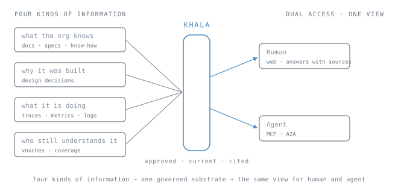

<p align="center">
  
</p>

<h1 align="center">Khala</h1>

<p align="center">
  <strong>An alliance of tools that calibrates the AI era.</strong>
</p>

<p align="center">
  <em>AI builds it. You understand it.</em>
</p>

---

Khala answers the **two failure modes of the AI era — the machine lies, and the
human stops judging** — with deterministic grounding, not advice. Khala is not a
tool you run; it is the link the tools share. The ecosystem is **Khala**; one of
its components is **Nexus**.

- **The machine lies** — stale or wrong, asserted with confidence. Defended by
  grounding answers in verifiable sources — and by mechanical checks, not trust:
  every citation is verified against the retrieved evidence, answer numbers must
  appear in that evidence, and answers built on stale sources are flagged.
- **The human stops judging** — AI output rubber-stamped without reading.
  Defended by making accountable review a gate before code is written.

## One substrate, four kinds of information

Khala exists so that everyone who builds and runs the service — humans *and* agents —
thinks from the **same information**. Documents alone don't cover that. Four kinds of
information drift apart in an AI-era org, and each one is a Khala surface:

<p align="center">
  
</p>

| Information | How it stays *the same* for everyone | Tool |
|---|---|---|
| **What the org knows** — docs, specs, know-how | One warehouse, two doors: humans (web) and agents (MCP/A2A) read the same governed corpus — same approvals, same current version, same citations. | [Nexus](./nexus) |
| **Why it was built** — design decisions | A flight recorder for decisions: the choices coding agents make by the hundred are recorded at zero marginal cost, and approval stays a named human's accountable act. | [Arbiter](./arbiter) |
| **What the system is doing** — traces, metrics, logs | Judgment context, not another dashboard: telemetry joined with approved knowledge (specs, runbooks, decisions) into evidence for review and troubleshooting. | [Observer](./observer) over Nexus + OTel |
| **Who still understands it** — comprehension | A cognitive-debt ledger: the warehouse is the denominator (what must be known), vouches are the numerator (what a named human can still explain) — the gap becomes a number you can repay. | [Adept](./adept) |

The first row is where a team starts — everyday value. The last row is why it matters
more every year: as agent output grows, an org that doesn't measure comprehension
doesn't even know what it no longer knows.

## The three debts of the AI era

As AI becomes the producer, three debts accumulate (Martin Fowler, "the three debts of the
AI era", 2026-04-02). Khala is the window where you pay them down cheaply — so you stay in
command of your own system:

- **Technical debt** — artifacts pile up faster than they're maintained → **Probe** + **Observer**.
- **Intent debt** — *why* a thing was built is lost → **Arbiter**.
- **Cognitive debt** — *nobody understands the system* → **Adept** measures it as vouch
  coverage against the shared warehouse, and drives its repayment.

The reframe is recorded in [ADR-0002](adr/ADR-0002-reframe-system-command-debt.md).

## The tools

| Tool | One-liner | Directory |
|---|---|---|
| **Nexus** | Enterprise RAG + GraphRAG — grounds answers in your docs and OTel telemetry. | [`./nexus`](./nexus) |
| **Archon** | Authority window over domain invariants — reads values from code constants at query time. Ships inside Nexus. | [`./nexus/nexus/claims`](./nexus/nexus/claims) |
| **Observer** | Platform-aware PR analyzer — PR scope, API spec lint/diff, review checklists; consumes Nexus. | [`./observer`](./observer) |
| **Arbiter** | ADR/SDD governance MCP — reviewable, traceable decision records; publishes to Nexus. | [`./arbiter`](./arbiter) |
| **Probe** | Mutation-driven test-quality harness — catches what advisory review misses. | [`./probe`](./probe) |
| **Adept** | Cognitive-debt meter — graded, grounded comprehension vouches; coverage + orphan hotlist. | [`./adept`](./adept) |
| **Adept web** | Team surface for the same meter — browser UI + server-backed (file or Postgres). | [`./adept-web`](./adept-web) |
| **docs** | Astro Starlight bilingual ecosystem documentation site. | [`./docs`](./docs) |

## Quickstart (Nexus · ~5분)

전제: Docker + Docker Compose. ([go-task](https://taskfile.dev) 있으면 `task`, 없으면 우측 명령 그대로)

```bash
# (선택) LLM 답변 생성용 — 없어도 근거 검색은 동작
export ANTHROPIC_API_KEY=sk-ant-...

task up        # 또는: cd nexus && docker compose up -d
task models    # 최초 1회 임베딩 모델 — 또는: docker compose exec nexus-ollama ollama pull nomic-embed-text
```

> **키 없이 답변 생성(dev):** 유료 키 없이도 서술을 돌릴 수 있습니다 — `NEXUS_LLM_PROVIDER=claude-code`
> 로 두고 `task llm-bridge` 를 띄우면 실행 중인 Claude Code 를 LLM 백엔드로 씁니다. 키는 품질 계층이지
> 핵심이 아닙니다.

→ 브라우저에서 **http://localhost:8000** 열기 → **채팅**에 질문하면 *근거와 함께* 답합니다.

- **문서 넣기:** 좌측 **업로드**, 또는 `docker compose exec nexus-app nexus ingest ./docs`
- **업데이트:** `git pull` 후 `task update` — 이미지 재빌드·재기동 + DB 마이그레이션 적용([nexus/migrations](nexus/migrations/README.md))
- **정지:** `task down` (또는 `docker compose down`)

## Documentation

Full ecosystem reference, philosophy, and per-tool guides live at the docs site:
**https://livinglikekrillin.github.io/khala/** (source in [`./docs`](./docs)).

## Conventions & license

- Contribution flow, naming, versioning, and terminology rules: [CONVENTIONS.md](./CONVENTIONS.md).
- Licensed under the [MIT License](./LICENSE).
