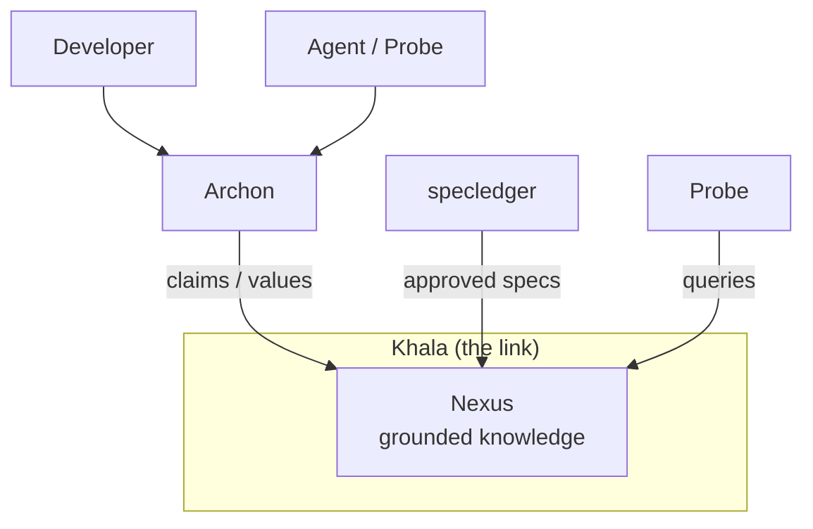

The three producer tools never call each other directly. They connect **only through Khala**.

- **Archon** is the single authority window: people and agents come to it to ask for domain truth.
- **Probe** is one client of that window, alongside developers.
- **specledger** publishes approved specs into Khala; it is not the source of truth (frontmatter is).
